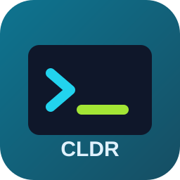
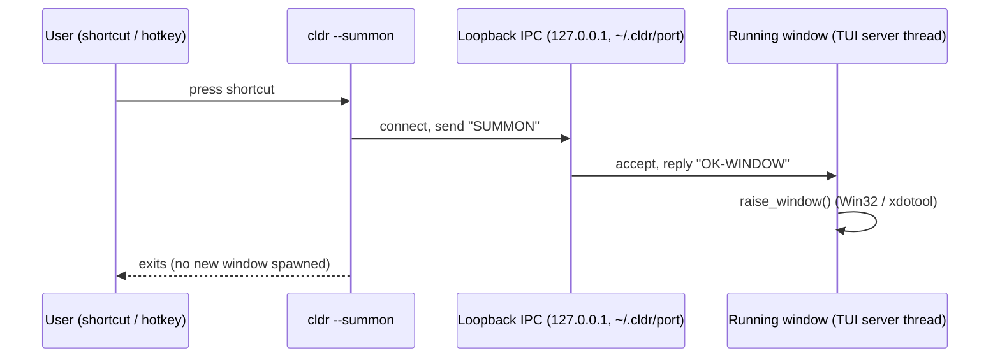

<!--
  CLDR — Command Line Dispatch & Route
  © 2026 Dr. Sohil Momin (drsamonline). All rights reserved.
  MIT-licensed: THE ABOVE COPYRIGHT / ATTRIBUTION NOTICE MUST BE RETAINED IN
  ALL COPIES OR SUBSTANTIAL PORTIONS OF THIS SOFTWARE. Removing this watermark
  is a violation of the license terms.
-->

<div align="center">



# ⚡ CLDR — Command Line Dispatch & Route

**A minimal, zero-bloat command launcher that lives in your notification tray and
summons its command window with a single shortcut.**

[](https://github.com/drsamonline/cldr/actions/workflows/build-release.yml)


[](LICENSE)
[](https://github.com/drsamonline/cldr/releases)

*by **[Dr. Sohil Momin](https://github.com/drsamonline)** · no Electron · no Tauri · no Qt/GTK · no async runtime*

</div>

---

## 📌 What is CLDR?

CLDR is a **single-binary command palette** for Windows and Linux. Launch it from a
desktop/Start-Menu **shortcut**, and it stays resident **in the background / notification
tray**. Pressing the shortcut or hotkey again **brings the command window forward**
instead of opening another copy. Type anything — math, paths, app names, searches — and
CLDR *routes* it to the right action instantly.

```text
┌─────────────────────────────  cldr  ─────────────────────────────┐
│ > 3*(4+2)                                                        │
│   [CALC] 3*(4+2) = 18                                            │
│ > code                                                           │
│   [RUN ] spawned via PATH                                        │
│ > notes.md                                                       │
│   [OPEN] notes.md → default editor                               │
│ Status: ready · C:\Users\you                          by Dr. S. Momin
└───────────────────────────────────────────────────────────────────┘
```

## ✨ Features

| | |
|---|---|
| 🚀 **Shortcut-bound launch** | One `.lnk` / `.desktop` entry; re-launching *summons* the existing window |
| 📴 **Background + tray-resident** | `cldr --tray` runs hidden, keeps the dispatch daemon alive, autostarts on login |
| 🧠 **Smart routing cascade** | math → existing path → PATH binary → DuckDuckGo web search |
| 🧮 **Zero-dep calculator** | `+ - * / ( ) unary-minus` parser written from scratch, fully unit-tested |
| 🪟 **True foreground summon** | Win32 `AttachThreadInput` foreground trick; `xdotool`/`wmctrl` on Linux |
| 🩺 **Hardware diagnostics** | `/sys` — cores, memory, hostname, user — without spawning tools |
| 🪶 **Near-idle daemon** | detached worker, sentinel-file IPC, ~0 CPU, <10 MB RSS |
| 🔒 **Attribution watermark** | every file carries the author notice; stripping it violates the license |

## 🗂️ In-window commands

| Command | Description |
|---|---|
| `/run <binary>` | spawn detached via OS shell |
| `/open <path>` | open file/folder in default viewer |
| `/ls [path]` | list directory (capped at 50) |
| `/find <name>` | recursive bounded search (depth 4) |
| `/web <query>` | DuckDuckGo search in browser |
| `/calc <expr>` | arithmetic `+ - * / ( ) unary-` |
| `/sys` | hardware diagnostics |
| `/help` · `/clear` | cheat sheet · clear pane |
| *(no prefix)* | auto-route: math → path → PATH app → web |

Full keybindings & behaviour: **[docs/USER_GUIDE.md](docs/USER_GUIDE.md)**

## 🏁 Quick start

```bash
git clone https://github.com/drsamonline/cldr && cd cldr
cargo build --release                      # one static-ish binary
./scripts/install-shortcut.sh              # Linux: shortcuts + tray autostart + hotkey
```

Windows (PowerShell):

```powershell
cargo build --release
powershell -ExecutionPolicy Bypass -File scripts\install-shortcut.ps1
```

That installer binds three shortcuts: **CLDR** (open window), **CLDR Summon**
(`--summon`, brings the running window forward), and a hidden **Startup tray entry**
(`--tray`, runs in background). See **[docs/SETUP_GUIDE.md](docs/SETUP_GUIDE.md)**.

## 🧲 How the tray + summon works



Loopback-only TCP control channel — **zero clipboard interference**, no
privileged APIs, no firewall exposure — plus a real background daemon
(`--daemon-start` / `--notify`) for queued `open`/`run`/`sys` requests.

> **v1.2:** the summon path moved from a clipboard mailbox to this IPC channel —
> your clipboard is never touched again, and re-launching the shortcut while a
> window is open simply raises it (single-instance guard).

## 📚 Documentation

| Document | Contents |
|---|---|
| [docs/USER_GUIDE.md](docs/USER_GUIDE.md) | complete walkthrough, keys, examples, troubleshooting |
| [docs/SETUP_GUIDE.md](docs/SETUP_GUIDE.md) | build, install, shortcut binding, autostart, releases |
| [docs/SHORTCUTS.md](docs/SHORTCUTS.md) | per-DE / per-tool hotkey recipes (KDE, GNOME, i3, PowerToys, AHK) |
| [CHANGELOG.md](CHANGELOG.md) | version history |
| [CONTRIBUTING.md](CONTRIBUTING.md) | dev workflow, code style, PR rules |
| [LICENSE](LICENSE) | MIT **with mandatory attribution** |

## 🏗️ Project layout

```text
src/
 ├─ main.rs     CLI router (foreground / --summon / --tray / daemon flags)
 ├─ engine.rs   dispatcher, calc parser, smart cascade (+ unit tests)
 ├─ tui.rs      ratatui command window + summon watcher wiring
 ├─ daemon.rs   detached background worker (sentinel-file IPC)
 └─ summon.rs   tray↔window bridge, Win32/Linux window raising, autostart
scripts/        shortcut installers (PS1 + sh) and uninstaller
assets/         tray/app icon
docs/           user guide, setup guide, shortcut recipes
```

## ⚖️ License & attribution

© **2026 Dr. Sohil Momin ([drsamonline](https://github.com/drsamonline))** —
[MIT licensed with a mandatory attribution clause](LICENSE). Every source, doc,
script, and asset in this repository carries an embedded watermark; **any copy must
retain the author's name**. Removing watermarks terminates the license grant.

<div align="center">

⭐ *Star it if it saves you a keystroke.* — made with ☕ and Rust by **Dr. Sohil Momin**

</div>
